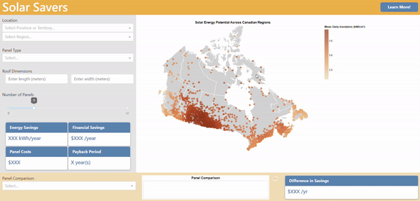

# Solar Savers 🌞 

A dashboard application helping Canadian homeowners in solar panel purchasing decisions.

## Our Purpose 

#### ❌ The Problem

The global need to shift towards sustainable energy sources has been recognized for decades, but its urgency continues to escalate. At the consumer-level, this problem is compounded by the rise in inflation and challenging decisions required when purchasing items like solar panels.

#### ✅ Our Solution
With this escalating inflation and growing environmental consciousness, consumers across Canada seek to save money where they can. Solar Savers, a user-friendly app, is designed to better equip homeowners in the decision-making process of purchasing solar panels for their home. With user's location, electricity rates, and panel quality, Solar Savers allows users to see their potential electricity and financial savings. It provides the required knowledge to assess the value of investing in solar panels and facilitates the decision-making process overall. 

## Usage

#### 🔍Try out the App!

To start using the Solar Savers dashboard, click here: [Solar Savers Dashboard](https://dsci-532-2024-9-solar-savers.onrender.com/). 

On the dashboard, embark on your journey by selecting your location, roof dimensions (optional), desired number of panels, and panel efficiency. Can't decide between two panels? Let our panel comparison widget at the bottom guide your decision.

Get started and watch in awe as your electricity and financial savings rise!



#### 🌱 Get involved!

If you are interested in contributing to the development of the Solar Savers dashboard, please read the [contributing guidelines](CONTRIBUTING.md) for full details. Below are some quick steps to run the dashboard locally. 

1. Clone the repository locally. In your terminal run:

    ```console
    $ git clone https://github.com/UBC-MDS/DSCI-532_2024_9_solar-savers.git
    ```

2. Create and activate the `conda` environment. In the root of the repository run:
    ```console
    $ conda env create --file environment.yml
    ```

    ```console
    $ conda activate solar-savers
    ```

3. Create a branch for local development and make your changes:

    ```console
    $ git checkout -b name-of-your-fix-or-feature
    ```

4. To run the dashboard, from the root of the directory (`DSCI-532_2024_9_solar-savers`) run: 

    ```console
    $ python -m src.app
    ```
5. Click on the displayed link to open view the dashboard on a browser.

## Contributing

Interested in contributing to this project? Check out the [contributing guidelines](CONTRIBUTING.md). *Please note: This project is released with a Code of Conduct. By contributing to this project, you agree to abide by the terms in the [Code of Conduct](CODE_OF_CONDUCT.md).* 

## Contact Us

If you'd like to suggest a new feature or if you experience a problem while using the dashboard, please open an [issue](https://github.com/UBC-MDS/DSCI-532_2024_9_solar-savers/issues). For problems, please include: 

- A description of the problem, indicating details that would be helpful in troubleshooting.
- Detailed steps to reproduce the problem.

## License

Solar Savers is developed and maintained by Marco Bravo, Nicole Bidwell, Rafe Chang, and Sam Fo. The code is licensed under the MIT License, Open Canada License, and Creative Commons License. Please see [LICENSE.md](LICENSE.md) for details.  

## Additional Credits

#### 📈 Data Sources 

- [Photovoltaic Potential and Solar Resource Maps of Canada](https://open.canada.ca/data/en/dataset/8b434ac7-aedb-4698-90df-ba77424a551f/resource/b4b8ede1-512c-4e6f-92af-d0ff38cf4de5) - data source used to extract the average daily global insolation across different regions in Canada.  
- [Electricity Prices in Canada 2023](https://www.energyhub.org/electricity-prices/#) - data source to extract the price of electricity of every province and territory in Canada.
- [VOLTS Solar Panels](https://volts.ca/collections/solar-panels) - data source to extract the price, size, and efficiency of different solar panel models.